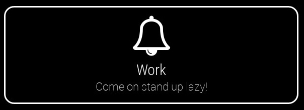
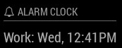

# MMM-AlarmClock [](https://raw.githubusercontent.com/fewieden/MMM-AlarmClock/master/LICENSE) [](https://travis-ci.org/fewieden/MMM-AlarmClock) [](https://codeclimate.com/github/fewieden/MMM-AlarmClock) [](https://snyk.io/test/github/fewieden/mmm-alarmclock) [](https://doclets.io/fewieden/MMM-AlarmClock/master)

Alarm Clock Module for MagicMirror<sup>2</sup>

## Example

   

## Dependencies

* An installation of [MagicMirror<sup>2</sup>](https://github.com/MichMich/MagicMirror)

## Installation

1. Clone this repo into `~/MagicMirror/modules` directory.
1. Configure your `~/MagicMirror/config/config.js`:

    ```
    {
        module: 'MMM-AlarmClock',
        position: 'top_right',
        config: {
            alarms: [
                {time: "18:30", days: [2,4], title: "Soccer", message: "Get ready for soccer training!"},
                ...
            ],
            ...
        }
    }
    ```

## Config Options

| **Option** | **Default** | **Description** |
| --- | --- | --- |
| `alarm` | `REQUIRED` | An Array with all your alarms as objects. Those objects need to have the properties -> time: 24h format, days: Array of all days the alarm should be fired (0 = Sunday, 6 = Saturday), title and message. |
| `sound` | `'alarm.mp3'` | Name and extension of your alarm sound. File needs to be placed in `~/MagicMirror/modules/MMM-AlarmClock/sounds`. Standard files are `alarm.mp3` and `blackforest.mp3`.  Alternatively specify a web stream `http` or `https`. |
| `volume` | `1.0` | The volume of the alarm sound in a range from `0.0` to `1.0` |
| `touch` | `false` | If you are using a touch screen device you need to press a button to disable an alarm.. |
| `format` | `'ddd, h:mmA'` | In which format the alarm in the header should be displayed. [All Options](http://momentjs.com/docs/#/displaying/format/) |
| `timer` | `60000` (1 min) | How long the alarm should ring for non touch screen or without interaction on touch screen devices. |
| `fade` | `false` | Set to enable a gradual fade-in of the alarm sound.
| `fadeTimer` | `60 * 1000` (1 min) | How long to fade into the alarm before `volume` is set.
| `fadeStep` | `.005` (.5%) | Increase the volume this percent amount each second until `fadeTimer` is reached.

## Alarm Sounds

There are already two alarm sounds:

* [alarm.mp3](http://www.orangefreesounds.com/mp3-alarm-clock/) | From Alexander licensed under [CC BY-NC 4.0](https://creativecommons.org/licenses/by-nc/4.0/)
* [blackforest.mp3](http://www.orangefreesounds.com/coo-coo-clock-sound/) | From Alexander licensed under [CC BY-NC 4.0](https://creativecommons.org/licenses/by-nc/4.0/)

## Developer

* `npm run lint` - Lints JS and CSS files.
* `npm run docs` - Generates documentation.

### Documentation

The documentation can be found [here](https://doclets.io/fewieden/MMM-AlarmClock/master)
